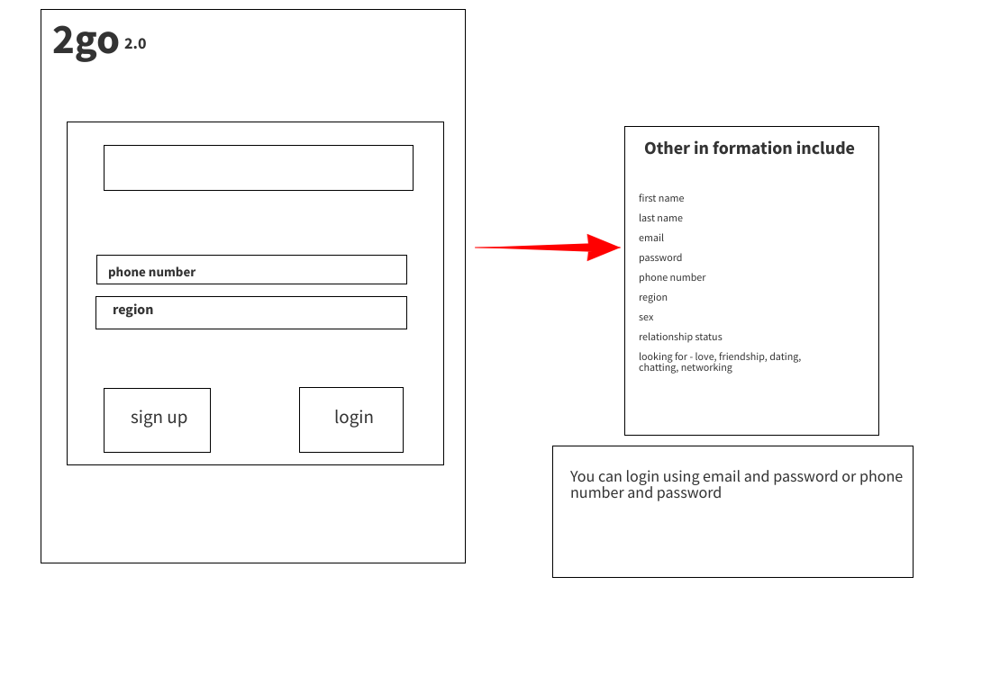
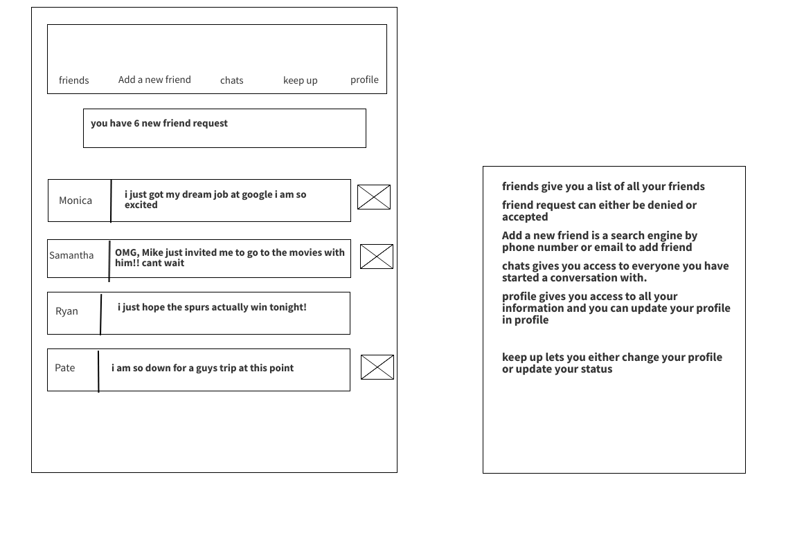
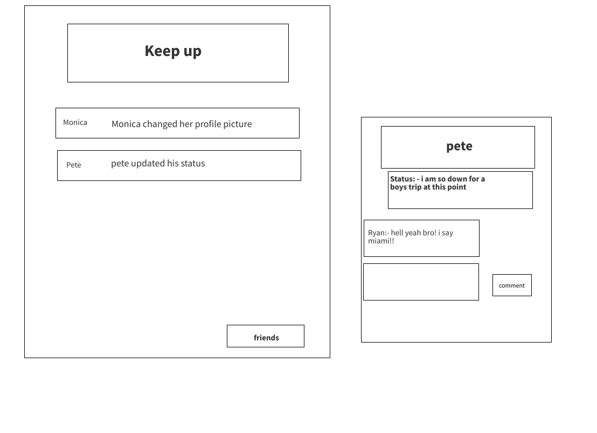

### solo-project3-frontend

# 2go-2.0

## Overview

2go was the hottest app when i was in middle school, and i am very sure i asked my first girlfriend out on the app. i think i would be a lovely challenge to go down memory lane and recreate an app i once held very truly to my heart.

###  Wireframes

### User Stories

- A user can signup a new account or login to an existing account
- A user can add new friends and view all their friends list
- A user can send another user a friend request, and the other user can either accept or denail the friend request.
- On load, a user can view all their active chats 
- A user can update their status and their frinds and comment on it 
- A user can send a direct message to all thier friends 
- They are levels to the chatting system, this levels are  Novice, Amatour, senior, enthusiast, professional, expert, and Leader
- After every 10 friends or 100 message you are moved to the next level of chatting 

### MVP LIST

- user can login and sign up 
- user can add friends
- user can chat with their friends 
- user can update their status
- friends can comment on users status

### Strech Goal

- the level system works perfectly
- you can create a group chat 
- Their is a 2go room where you can join people either between certain age group or people with similar interest

